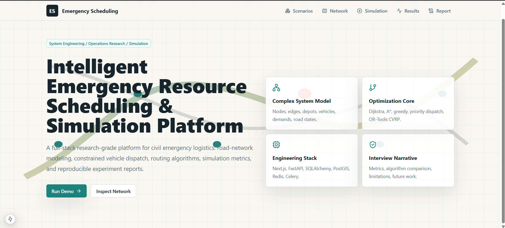
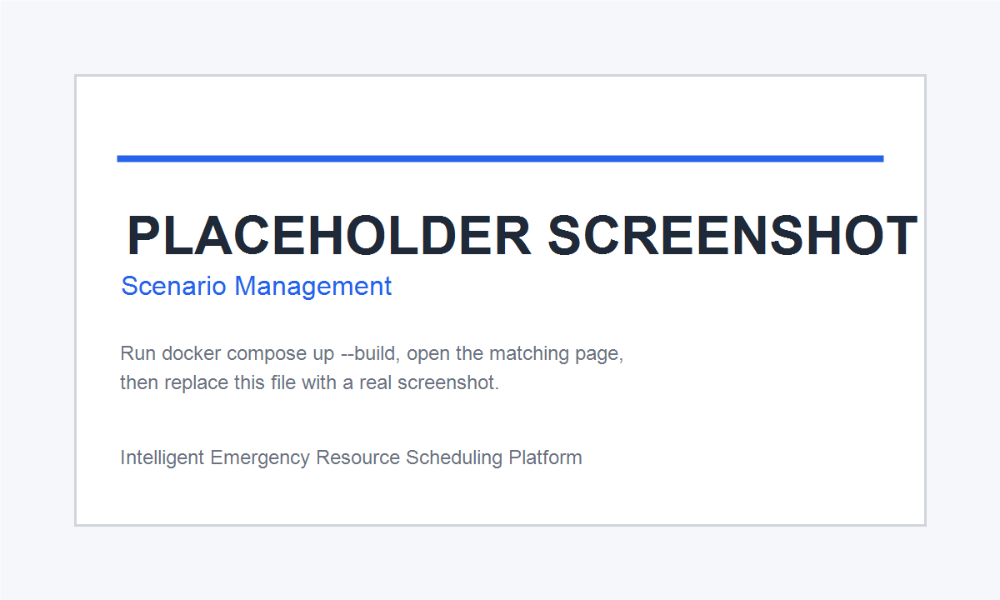
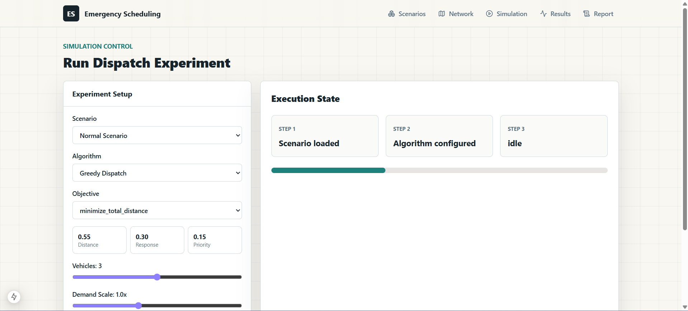
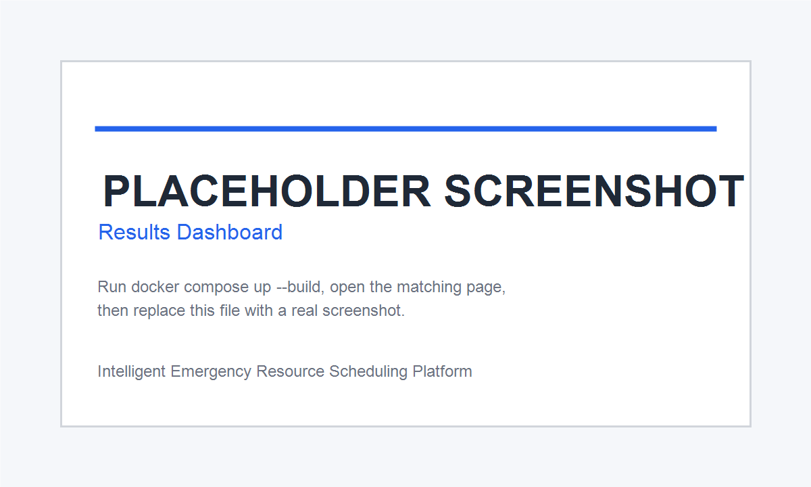
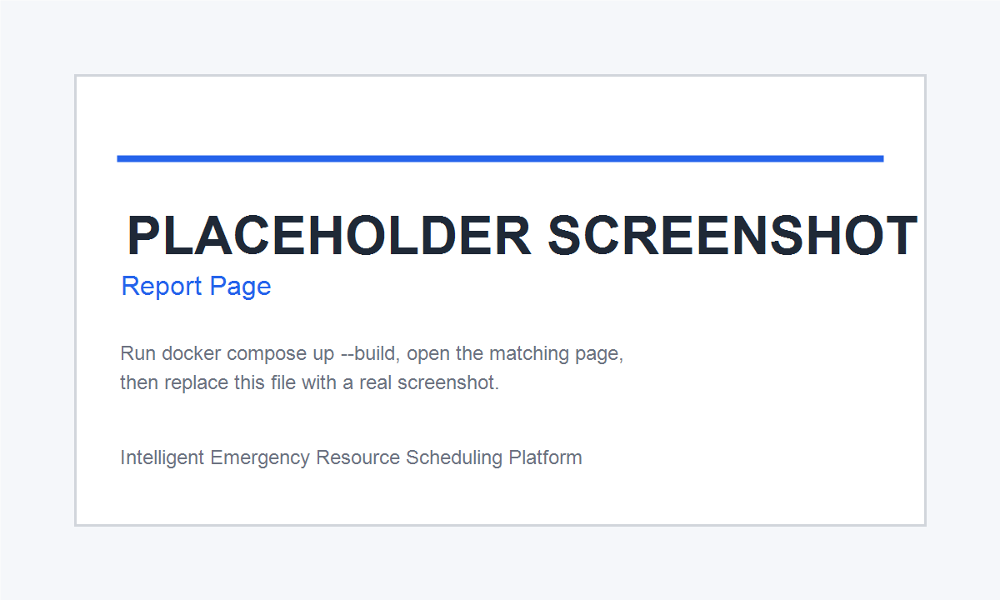
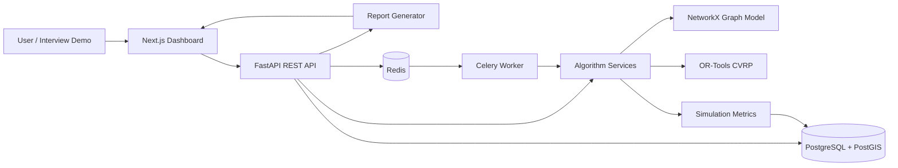
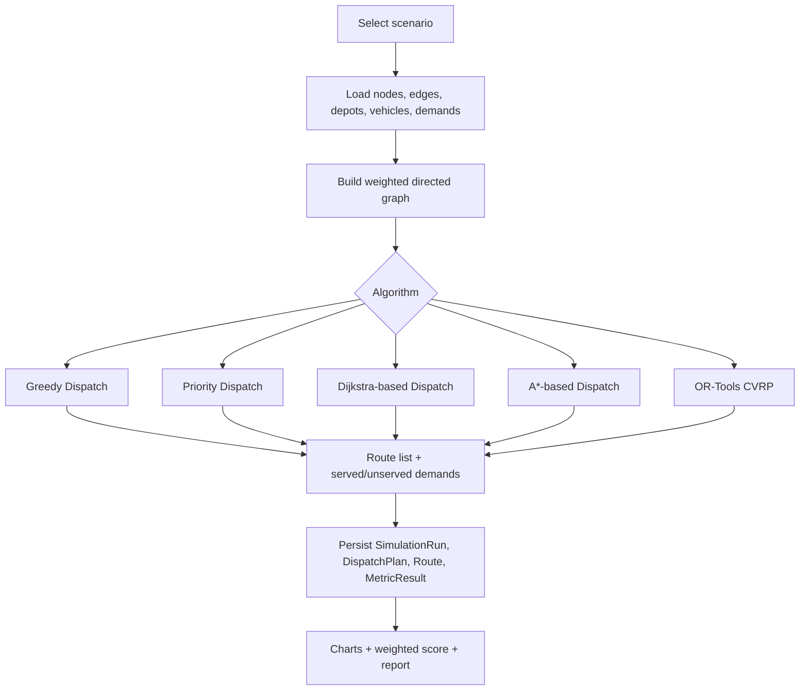

# Intelligent Emergency Resource Scheduling & Simulation Platform

面向应急资源调度的复杂系统建模、优化与仿真平台

> A full-stack civil emergency logistics platform that turns road networks, vehicles, depots, demands, congestion, and blocked roads into reproducible dispatch optimization experiments.


## Demo Preview

The images below are screenshots from the running app.

| Landing | Scenarios | Network |
| --- | --- | --- |
|  |  |  |

| Simulation | Results | Report |
| --- | --- | --- |
|  |  |  |

To refresh screenshots, start the app, open `/`, `/scenarios`, `/network`, `/simulation`, `/results`, and `/report`, then replace the matching PNG files in `docs/images/`.

## Quick Start

```bash
cp .env.example .env
docker compose up --build
```

Open:

- Frontend dashboard: [http://localhost:3000](http://localhost:3000)
- Swagger / OpenAPI: [http://localhost:8000/docs](http://localhost:8000/docs)
- OpenAPI JSON: [http://localhost:8000/openapi.json](http://localhost:8000/openapi.json)

Useful commands:

```bash
make dev
make test
make lint
make seed
python scripts/check_project.py
```

## Core Features

- Scenario management for six standard experiment scenarios: Normal, Congestion, Demand Surge, Resource Shortage, Blocked Road, and High Priority Rescue.
- Road-network visualization with depots, vehicles, demands, congested edges, and blocked edges.
- Dispatch simulation with Greedy, Priority-based, Dijkstra-based, A*-based, and OR-Tools CVRP algorithms.
- Unified metrics: total distance, response time, completion rate, priority completion, vehicle utilization, delayed demands, unserved demands, and runtime.
- Algorithm comparison charts and weighted score ranking for system-engineering decision support.
- Deterministic Markdown report generation, with optional OpenAI-compatible report polishing when an API key is configured.
- Docker Compose stack with frontend, backend, PostgreSQL/PostGIS, Redis, and Celery worker.

## System Architecture



## Algorithm Flow



## Standard Experiment Scenarios

| Scenario | Vehicles | Demands | Road State | Expected Challenge |
| --- | ---: | ---: | --- | --- |
| Normal Scenario | 3 | 6 | Normal | Control group for baseline comparison. |
| Congestion Scenario | 3 | 6 | Center links congested | Tests response-time robustness under slow roads. |
| Demand Surge Scenario | 4 | 9 | Normal | Tests scalability under sudden demand growth. |
| Resource Shortage Scenario | 2 | 6 | Normal | Tests capacity bottlenecks and unserved-demand tradeoffs. |
| Blocked Road Scenario | 3 | 6 | Critical center links blocked | Tests detour routing and graph connectivity. |
| High Priority Rescue Scenario | 3 | 7 | Mild east/south congestion | Tests high-priority completion and urgency-aware dispatch. |

## Experiment Result Example

This table shows the expected interpretation style after running `Compare Algorithms`. Exact values are generated by the backend from the selected scenario and are not hard-coded in the README.

| Algorithm | Main Strength | Typical Tradeoff | Best Demo Scenario |
| --- | --- | --- | --- |
| Greedy Dispatch | Fast baseline and easy explanation | Local decisions can miss global quality | Normal Scenario |
| Priority Dispatch | Improves urgent-task completion | May increase distance | High Priority Rescue Scenario |
| Dijkstra-based Dispatch | Transparent shortest-path baseline | Dispatch order is still heuristic | Blocked Road Scenario |
| A*-based Dispatch | Heuristic-guided path planning | Benefit depends on graph scale and heuristic quality | Congestion Scenario |
| OR-Tools CVRP | Capacity-constrained routing baseline | Higher runtime; infeasible cases can fall back | Resource Shortage Scenario |

Weighted score model:

```text
score =
0.30 * completion_rate
+ 0.25 * priority_completion_rate
+ 0.20 * normalized_response_time_score
+ 0.15 * normalized_distance_score
+ 0.10 * normalized_runtime_score
```

## Graduate Admission Interview Value

This project is designed for Electronic Information 0854 / System Engineering interview discussion:

- Complex system modeling: road network, resources, vehicles, demands, constraints, and feedback metrics.
- Data structures and algorithms: graph modeling, Dijkstra, A*, greedy assignment, and priority-aware dispatch.
- Operations research: CVRP-style capacity constraints with OR-Tools as a solver baseline.
- Simulation evaluation: reproducible scenarios, unified metrics, weighted score, and report generation.
- Full-stack engineering: Next.js dashboard, FastAPI APIs, SQLAlchemy models, PostGIS-ready spatial data, Docker Compose, tests, and CI.

Interview materials:

- `docs/project_summary_3_pages.md`
- `docs/defense_presentation_outline.md`
- `docs/interview_questions.md`
- `docs/english_project_pitch.md`
- `docs/resume_bullets.md`
- `docs/demo_script.md`

## Project Structure

```text
emergency-scheduling-platform/
  backend/
    app/
      algorithms/        # Graph, shortest path, dispatch, metrics
      api/               # FastAPI route handlers
      models/            # SQLAlchemy domain models
      reports/           # Deterministic and optional LLM report generation
      seeds/             # Six standard experiment scenarios
      services/          # Scenario and simulation orchestration
      tests/             # pytest unit and integration tests
  frontend/
    src/app/             # Next.js App Router pages
    src/components/      # UI building blocks
    src/lib/             # API client and app store
    src/types/           # Shared frontend types
  docs/
    images/              # Demo screenshots or clearly labeled placeholders
    *.md                 # System design, algorithms, reports, interview package
  scripts/
    check_project.py     # Local acceptance checker
  docker-compose.yml
  Makefile
  README.md
```

## API Surface

Responses use a unified envelope:

```json
{"success": true, "message": "ok", "data": {}}
```

Key endpoints:

- `GET /api/health`
- `GET /api/scenarios`
- `GET /api/scenarios/{id}/network`
- `GET /api/scenarios/{id}/demands`
- `GET /api/scenarios/{id}/vehicles`
- `POST /api/scenarios/{id}/run`
- `GET /api/simulation-runs/{id}/routes`
- `GET /api/simulation-runs/{id}/metrics`
- `POST /api/scenarios/{id}/compare`
- `GET /api/scenarios/{id}/comparison`
- `POST /api/reports/{run_id}/generate`

## Local Development

Backend tests:

```bash
cd backend
DATABASE_URL=sqlite+pysqlite:// AUTO_SEED_DEFAULTS=false python -m pytest -q
```

Frontend build:

```bash
cd frontend
npm install
npm run build
```

Project acceptance check after Docker startup:

```bash
python scripts/check_project.py
```

## Demo Flow

1. Open `/scenarios` and show the six seeded benchmark scenarios.
2. Open `/network` and explain the graph model: nodes, edges, depots, vehicles, demands, congestion, and blocked roads.
3. Open `/simulation`, select a scenario, and run `Compare Algorithms`.
4. Open `/results` and explain metric cards, route visualization, comparison charts, and weighted score ranking.
5. Open `/report` and generate a deterministic Markdown experiment report.

For a ready-to-read script, see `docs/demo_script.md`.

## Roadmap

- Rolling-horizon re-optimization for dynamic demands.
- Full VRPTW with hard and soft time-window constraints.
- Real map data through MapLibre or Leaflet.
- Batch experiment management and scenario versioning.
- PDF report export.
- Frontend component tests and CI security-audit policy.

## License

MIT License. See `LICENSE`.
