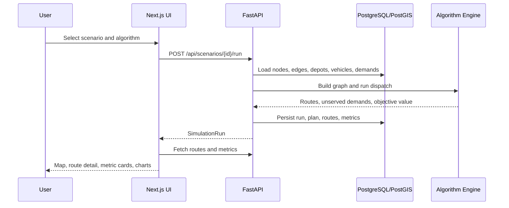

# System Design

## Positioning

This platform models civil emergency resource scheduling as a complex system: transportation network, supply depots, limited vehicle capacity, uncertain road states, priority demand, and algorithm evaluation.

中文说明：项目面向公开民用场景，重点展示系统工程中的建模、优化、仿真和工程闭环，不涉及军事、涉密或攻击性内容。

## Frontend Architecture

- Next.js App Router provides pages for landing, scenarios, network visualization, simulation control, results, and reports.
- TypeScript keeps API data contracts explicit.
- Tailwind CSS and small shadcn-style components provide a consistent product dashboard.
- Recharts renders algorithm comparison charts.
- Zustand stores selected scenario and latest simulation run on the client.

## Backend Architecture

- FastAPI exposes REST endpoints and OpenAPI documentation.
- SQLAlchemy 2.x models represent the simulation domain.
- Alembic creates database schema and PostGIS spatial columns.
- PostgreSQL/PostGIS stores network and scenario data.
- Redis/Celery are included for asynchronous simulation tasks; the MVP API runs synchronously for immediate demo feedback.
- NetworkX handles graph modeling and shortest-path algorithms.
- OR-Tools handles the CVRP baseline.

## Data Flow

## Module Responsibilities

- `models/`: database entities and relationships.
- `seeds/`: deterministic benchmark scenarios.
- `algorithms/`: graph construction, shortest path, dispatch, metrics.
- `services/`: transaction-level orchestration for scenarios and simulations.
- `api/`: HTTP boundary and uniform response envelope.
- `reports/`: deterministic report template and optional LLM rewrite.

## Technology Choices

- FastAPI: strong typing, fast OpenAPI generation, good for algorithm services.
- Next.js: clear dashboard routing and deployable frontend architecture.
- NetworkX: mature graph modeling library, ideal for explaining Dijkstra and A*.
- OR-Tools: industry-standard operations research toolkit for CVRP/VRP baselines.
- PostgreSQL/PostGIS: reliable relational storage with spatial extension for road-network data.
- Redis/Celery: extensible async execution path for longer simulation experiments.

## Tradeoffs

- The MVP runs simulations synchronously in the API for a better first demo loop. Celery is wired for extension.
- Spatial columns exist in Alembic/PostGIS, while algorithms use latitude/longitude fields for portability and SQLite tests.
- The first frontend map uses SVG to keep the demo stable; MapLibre/Leaflet can be added later when real geographic tiles are needed.

